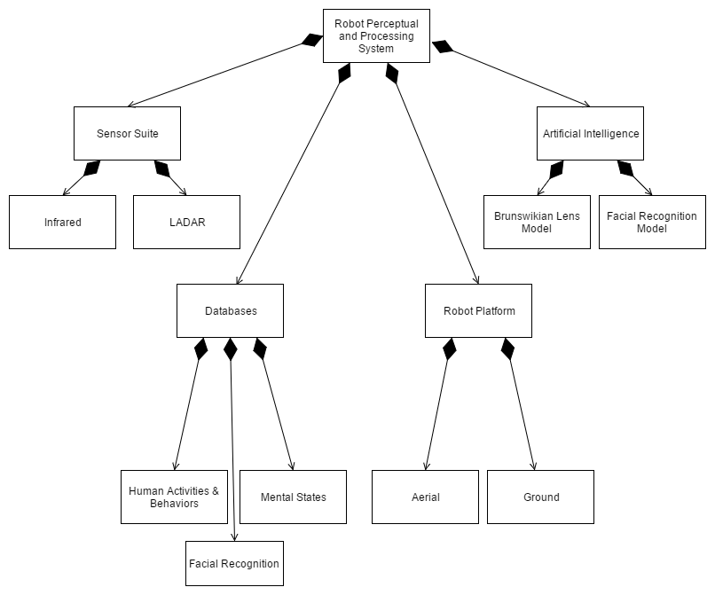

# Assignment 1 - Practice Designing Models

> * Participant name: Samantha Warta
> * Project Title: Human-robot Mixed Crime Response Team — Robotic Perceptual and Processing System

## General Introduction

A **smart city** is an urban area that uses different types of electronic data collection sensors to supply information which is used to manage assets and resources efficiently.

Violent crimes possess the capacity to devastate the lives of both victims and their families as well as reduce the number of productive members in society through either death or disability. However, this proposal outlines a system designed to facilitate crime reduction through the use of human-robot mixed teams and more specifically, the *Robotic Perceptual and Processing System* (RPPS). The RPPS is a robotic system intended to enable human social cue perception and mental state evaluation through the use of sensor suites coupled with statistical analysis. 

The FBI’s Uniform Crime Reporting (UCR) Program (U.S. Department of Justice, 2017) defines violent crime as “offenses that involve force or threat of force”. Specifically, the offenses that constitute violent crime are: (a) murder and nonnegligent manslaughter, (b) rape, (c) robbery, and (d) aggravated assault. According to the FBI’s uniform crime reporting program (U.S. Department of Justice—Federal Bureau of Investigation, 2017), the estimated number of violent crimes rose 4.1% from 2015 to 2016.

When on patrol, police officers are required to be capable of making increasingly complex judgments when it comes to tracking and identifying other humans. As a result, they are able to identify potential problems, whether it be a citizen in distress or an individual about to commit, or in the process of committing a crime. Given this, it stands to reason that officers engage in the attribution of mental states (i.e., emotions, intentions, beliefs) while involved in these tasks. However, humans are prone to error throughout the decision-making process, which is why this proposal will outline a robotic system capable of removing human error from the equation and indirectly affecting crime rates.

## Requirements (Experimental Design)

The Robot Perceptual and Processing System would be designed such that it would offer three distinct capabilities: 
1. Function as an integrated social cue perception and social signal interpretation system
2. Support the capability of unique human recognition
3. Enable the ability to measure precise temperature gradients and link these to human social signals

*Hypothesis 1.* Utilizing a mid-wave infrared sensor, the RPPS will detect social cues expressed by humans based on infrared emission measurement. Additionally, it will be able to map facial capillaries based on IR emissivity. Mid-wave infrared sensors will enable the RPPS to perceive the infrared radiation generated by the activation of muscles and blood flow as a function of expressed social cues. The resolution in mid-wave infrared sensors varies according to the size (in degrees) of the field of view under current examination. Concurrent with this is also the robotic platform’s proximity to the human currently under surveillance. A sensor test will confirm correct calibrations to enable the proper sensitivity and specificity levels required to detect social cues. Contrast ratios will be assessed before purchase.

*Hypothesis 2.* Use of the RPPS by police forces will influence the incidence of violent crime, by facilitating robotic perception and interpretation of human social cues and signals. The purpose of the RPPS is to support the use of robotic teammates alongside human interactors by reducing error in judgment tasks and facilitating improved safety, efficiency, effectiveness, and objective completion. 
Individual task completion and overall objective completion will be measured during which the RPPS will be utilized alongside a police squad participating in a mock scenario. An identical mock scenario, with a participating police squad, will be used as a control. Within these scenarios, safety will be measured on the condition of police/bystander casualty/injury events, efficiency will be measured as a function of time, effectiveness can be evaluated in terms of cognitive workload assessment, and objective completion will be measured in terms of objectives met/tasks completed.

## Smart City Robot Perceptual and Processing System (RPPS) Model

At a high level, the *Robot Perceptual and Processing System*, or RPPS, is composed of a robotic platform equipped with a sensor suite, artificial intelligence module, and database access modules. 

The links below detail the individual components of the RPPS in varying levels of resolution:

* [**Object Diagram**](model/object_diagram.md) - provides the high level overview of the Robot Perceptual and Processing System (RPPS) components
* [**Class Diagram**](model/class_diagram.md) - provides details of the Robot Perceptual and Processing System (RPPS)
* [**Behavior Diagram**](model/behavior_diagram.md) - provides details of the Robot Perceptual and Processing System (RPPS)

## Smart City Robot Perceptual and Processing System (RPPS) Simulation

[**Simulation Overview**](analysis/README.md) 

Given that the use of passive infrared sensors for facial recognition and expression recognition is currently rare in practice, establishment of its appropriateness for use in the RPPS should be the first step. Presently, these types of sensors have been employed in a select few cases for facial recognition (Bourlai, Ross, Chen, & Hornak, 2012) and facial expression recognition (Wang, Shen, & Liu, 2012). Additionally, Khan, Ward, and Ingleby (2009) have employed infrared thermography in a robotic platform to aid in emotion attribution. However, to the best of my knowledge, mid-wave infrared sensors have never been used in this capacity. 

On the other hand, the unique facial recognition module that has been proposed for the RPPS, would leverage the structure of human facial capillaries to achieve recognition success, given that facial capillaries are biologically unique to each individual, and would enable differentiation from person to person. Previous research has explored several different techniques for instantiating such a mechanism (e.g., Buddharaju, Pavlidis, Tsiamyrtzis, & Bazakos, 2007; Koukiou, & Anastassopoulos, 2015; see Ghiass, Arandjelovic, Bendada, & Maldague, 2014 and Unar, Seng, & Abbasi, 2014 for a review).

Lastly, once the appropriateness of the sensor suite has been established, the primary concern would be the performance of the Brunswikian Lens model (Cooksey, 1996; Doherty & Kurz, 1996; Hammond, 1993; Vicente, 2003). This model is key to the RPPS’s ability to interpret social cues and comes to meaningful conclusions about the social signals conveyed by human interactors. To accurately simulate the three aforementioned problems, continuous-based simulations would be most appropriate.

## Smart City Robot Perceptual and Processing System (RPPS) Model
[**Code template**](code/README.md) - Starting coding framework for the Robot Perceptual and Processing System (RPPS).

<b>

## Part 5 - From Code to Model 
### **P**ortable **O**rganic **T**rouble-free **S**elf-watering System (**POTS**) Model
For assignment 1, look at the classes defined in the following Github repository. Create both an object and a class diagram for the code.
 

[**POTS System Overview**](code/POTS_system/README.md)

* [**POTS Object Diagram**](images/Assigment1_POTS_ObjectDiagram.png)
* [**POTS Class Diagram**](images/Assigment1_POTS_ClassDiagram.png)

 

## **References**

Bourlai, T., Ross, A., Chen, C., & Hornak, L. (2012). A study on using mid-wave infrared images for face recognition. In *SPIE Defense, Security, and Sensing* (pp. 83711K-83711K). International Society for Optics and Photonics.

Buddharaju, P., Pavlidis, I. T., Tsiamyrtzis, P., & Bazakos, M. (2007). Physiology-based face recognition in the thermal infrared spectrum. *IEEE Transactions on Pattern Analysis and Machine Intelligence, 29*(4), 613-626.

Cooksey, R. W. (1996). The methodology of social judgement theory. *Thinking & Reasoning, 2*(2-3), 141-174.

Doherty, M. E., & Kurz, E. M. (1996). Social judgement theory. *Thinking & Reasoning, 2*(2-3), 109-140.

Ghiass, R. S., Arandjelovic, O., Bendada, A., & Maldague, X. (2014). Infrared face recognition: A comprehensive review of methodologies and databases. *Pattern Recognition, 47*(9), 2807-2824.
	
Hammond, K. R. (1993). Naturalistic decision making from a Brunswikian viewpoint: Its past, present, future. In G. A. Klein, J. E. Orasanu, R. E. Calderwood, & C. E. Zsambok (Eds.) *Decision making in action: Models and methods* (pp. 205-227). Norwood, NJ: Ablex Publishing.

Khan, M. M., Ward, R. D., & Ingleby, M. (2009). Classifying pretended and evoked facial expressions of positive and negative affective states using infrared measurement of skin temperature. *ACM Transactions on Applied Perception, 6*(1), 1-6.

Koukiou, G., & Anastassopoulos, V. (2015). Neural networks for identifying drunk persons using thermal infrared imagery. *Forensic Science International, 252*, 69-76.

Unar, J. A., Seng, W. C., & Abbasi, A. (2014). A review of biometric technology along with trends and prospects. *Pattern Recognition, 47*(8), 2673-2688.

U.S. Department of Justice. (2017). Violent crime. In *FBI: UCR* (Definition). Retrieved from https://ucr.fbi.gov/crime-in-the-u.s/2016/crime-in-the-u.s.-2016/topic-pages/violent-crime

U.S. Department of Justice—Federal Bureau of Investigation. (September 25, 2017). Uniform Crime Report: Crime in the United States, 2016. Retrieved from https://ucr.fbi.gov/crime-in-the-u.s/2016/crime-in-the-u.s.-2016/resource-pages/cius-summary.pdf

Vicente, K. J. (2003). Beyond the lens model and direct perception: Toward a broader ecological psychology. *Ecological Psychology, 15*(3), 241-267.

Wang, S., Shen, P., & Liu, Z. (2012). Facial expression recognition from infrared thermal images using temperature difference by voting. In *2012 IEEE 2nd International Conference on Cloud Computing and Intelligence Systems* (Vol. 1, pp. 94-98). IEEE.

Wiltshire, T. J., Lobato, E. J., McConnell, D. S., & Fiore, S. M. (2015). Prospects for direct social perception: a multi-theoretical integration to further the science of social cognition. *Frontiers in Human Neuroscience, 8*, 1007. doi:10.3389/fnhum.2014.01007

Wiltshire, T. J., Snow, S. L., Lobato, E. J., & Fiore, S. M. (2014). Leveraging social judgment theory to examine the relationship between social cues and signals in human-robot interactions. *Proceedings of the Human Factors and Ergonomics Society Annual Meeting, 58*, 1336-1340. Human Factors and Ergonomics Society. doi:10.1177/1541931214581279
