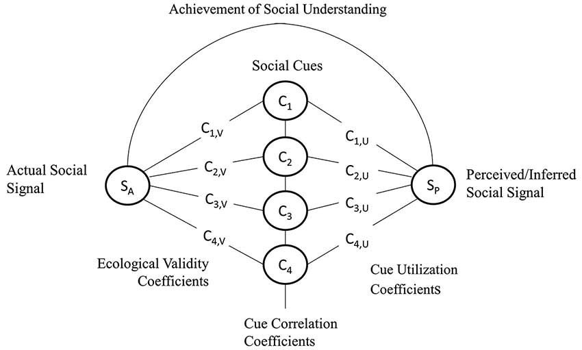
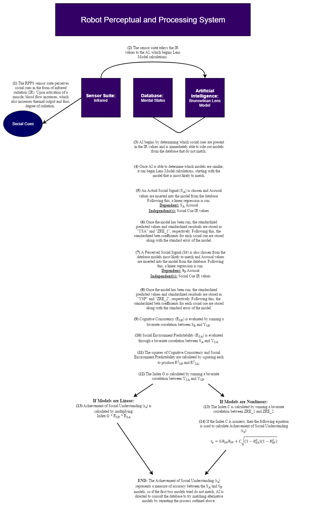

## Smart City Robot Perceptual and Processing System (RPPS) Simulation

[**Robot Perceptual and Processing System (RPPS) Model Overview**](../model/README.md)

To address *Hypothesis 1* and establish that a mid-wave infrared (IR) sensor is the most appropriate sensor suite for the perception of social cues and mapping of facial capillaries, continuous-based simulation is required to generate infrared signatures and temperature distribution data correlating to models of objects in a real-world environment. In this case, we are concerned with how several of the following attributes of the IR sensor would perform under real-world conditions:

1.	The resolution and contrast ratio required to perceive social cues and map facial capillaries
2.	Performance under different types of weather
3.	Performance based on different lens assemblies
4.	Performance under varying cooling system outfittings

To address *Hypothesis 2*, that the RPPS will produce an effect on violent crime incidences, continuous-based simulation would be most appropriate. In this context, the focus is not on how individuals interact with the system, but its usefulness resides in how it performs from an analytical standpoint. Here, we are primarily concerned about the performance of the Brunswikian Lens model (see Figure 1; Cooksey, 1996; Doherty & Kurz, 1996; Hammond, 1993; Vicente, 2003) and its ability to accurately predict threats or identify individuals in distress.

 

*Figure 1.* Representation of the Social Cues and Signals Lens Model (Wiltshire et al., 2015).

 

The Lens Model Equation (LME; Wiltshire et al., 2014) was adopted to investigate how humans use social cues in their environment to draw conclusions about the mental states of others. The LME provides a direct comparison between the two interacting systems, the ecological environment and the participant’s cognitive processes that contribute to mental state attribution. According to Cooksey (1996):

>The LME is an elegant, precise mathematical formulation of a simple truth. That is, a person’s ability to make correct judgements about reality is a function of three things: (1) how predictable the world is (*Re*), (2) how well the person knows the world (*G* and *C*), and (3) how consistently the person can apply his or her knowledge (*Rs*). (p. 165)

Simply put, the Lens Model quantifies various aspects of the relationship between two sub-systems, the social environment and the cognitive processes taking place within an individual. Our version of the Lens Model specifies how perceptions or inferences of a social signal (SP) can be made with regard to the proximal and projectable social cues (Ci) that are available to an organism’s perceptual systems (see Figure 2). If, indeed, the perceived social signal (SP) matches the actual social signal (SA) then this would lead to the achievement of social understanding. Essentially, the LME allows the empirical linkage of low-level observable cues from the environment with higher level mental states attributed to others.

  

*Figure 2.* Representation of the Lens Model computational process.