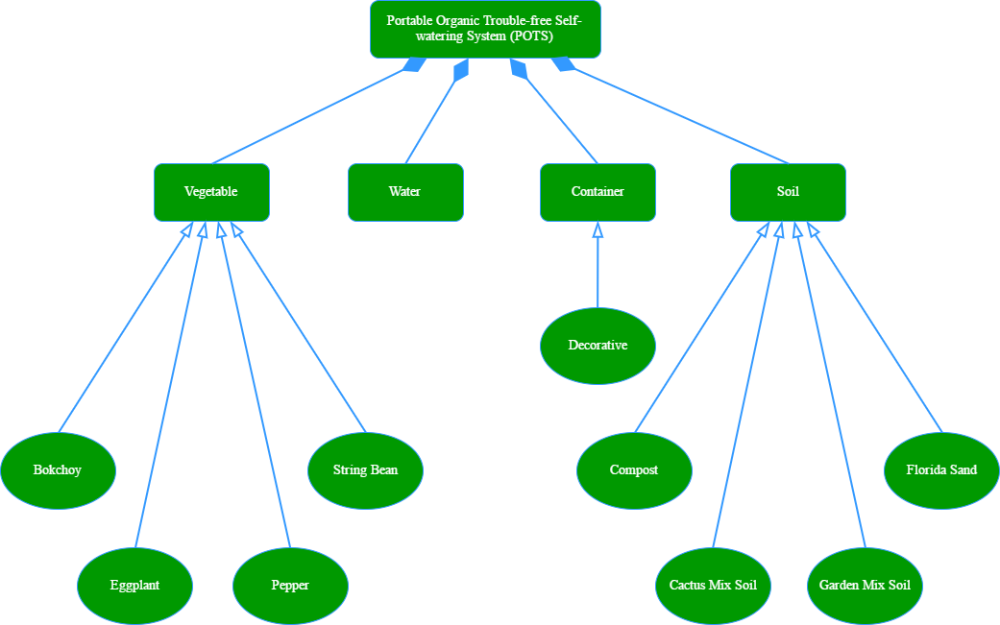
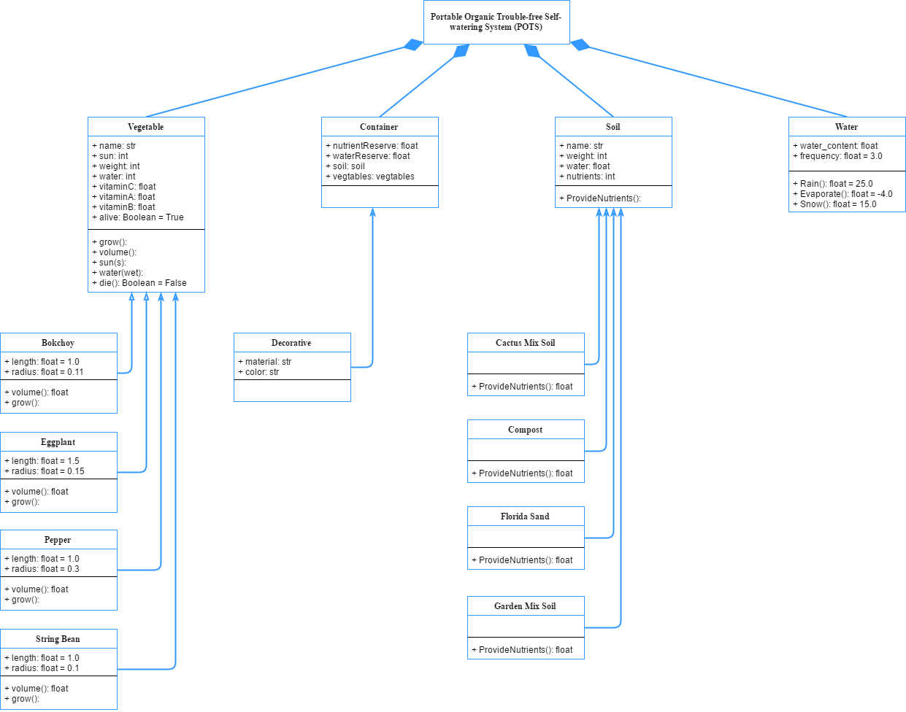

## **P**ortable **O**rganic **T**rouble-free **S**elf-watering System (**POTS**) Model

The Portable Organic Trouble-free Self-watering System (POTS) is comprised of four main components:
* **Vegetables**
    * Bokchoy
    * Eggplant
    * Pepper
    * String Bean
* **Container**
    * Decorative
* **Soil**
    * Cactus Mix Soil
    * Compost
    * Florida Sand
    * Garden Mix Soil
* **Water**

These four main components, or classes, are defined by the varying types of vegetables; containers, decorative or otherwise; differing types of soil; and water. This code represents a basic simulation loop that randomly generates a type of vegetable and allows you to simulate its growth by controlling factors such as the weather, water levels, nutrients and nutrient composition, and soil type.

 

The [**object diagram**](../../images/Assigment1_POTS_ObjectDiagram.png) below offers a very high level overview of the POTS system model.

 

The [**class diagram**](../../images/Assigment1_POTS_ClassDiagram.png) below offers a more detailed look at the four main components, or classes, and the factors that define them.
