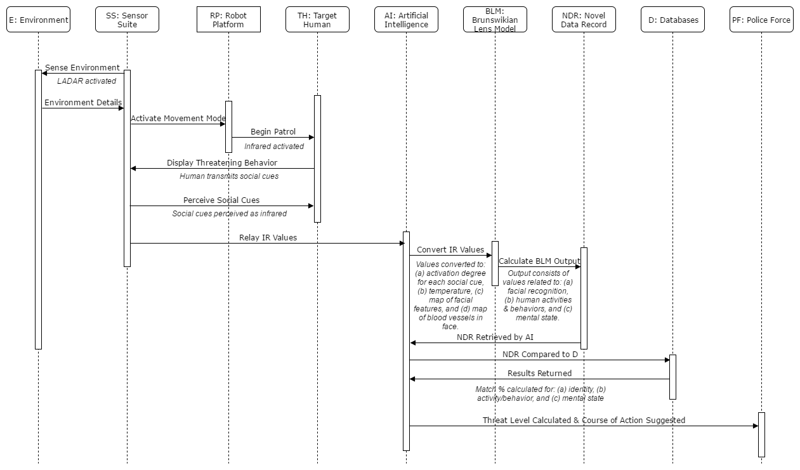

## Smart City Robot Perceptual and Processing System (RPPS) Model - Behavior Diagram

The behavior diagram below illustrates a typical surface interaction between each of the RPPS's sub-systems. The following components interact in the system:

* **Sensor Suite**
    * Environment
* **Robot Platform**
* **Target Human**
* **Artificial Intelligence**
    * Brunswikian Lens Model
    * Novel Data Record
* **Databases**
* **Police Force**

