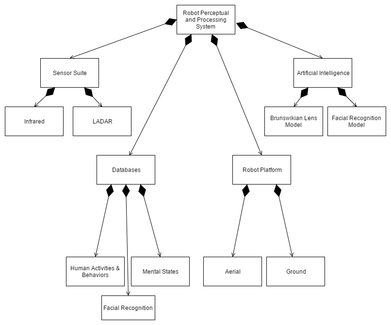

## Smart City Robot Perceptual and Processing System (RPPS) Model - Object Diagram

The *Robot Perceptual and Processing System*, or RPPS, is composed of several second-level sub-systems that form the central components of the overall system. The primary sub-systems are as follows and detailed below in the object diagram:
* ***Robot Perceptual and Processing System*** 
    * **Robot Platform**
        * Aerial
        * Ground
    * **Sensor Suite**
        * Infrared
        * LADAR
    * **Artificial Intelligence**
        * Brunswikian Lens Model
        * Facial Recognition Model
    * **Databases**
        * Human Activities & Behaviors
        * Facial Recognition
        * Mental States

